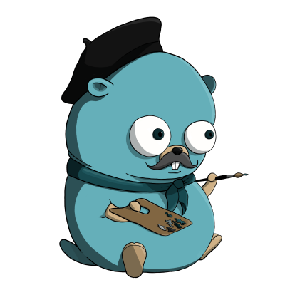

# grafik

[![Build Status][ci-badge]][ci-yml]
[![CodeQL][codeql-badge]][codeql-link]
[![Go Report Card][go-report-card-badge]][go-report-card-link]
[![codecov][codecov-badge]][codecov-link]
[![Latest Tag][latest-tag-badge]][gh-tags]
[![Go Reference][godoc-badge]][godoc-link]
[![GitHub][mit-badge]][mit-link]
[![PRs Welcome][pr-welcome-badge]][gh-contribute]

<p align="center"></p>

**grafik** [*/ˈɡra.fik/*] (Origin: Polish): illustrator, graphic designer

Grafik is a schema based GraphQL [Go][golang] code generator & HTTP client.

## Foreword
Grafik is still in **early stage** and under **active development**. If you notice a bug, or you would like to request a new feature, please raise an issue/PR.

## Installation
Assuming you have [Go][golang] installed on your machine, first install `grafikgen`.

**Note**: Make sure to add `$GOPATH/bin` to your `PATH`.

### Go version < 1.16

```bash
GO111MODULE=on go install github.com/Bartosz-D3V/grafik/grafikgen@latest
```

### Go 1.16+

```bash
go install github.com/Bartosz-D3V/grafik/grafikgen@latest
```

To add grafik GraphQL client add grafik as a dependency to the project:

```shell
go get github.com/Bartosz-D3V/grafik
```

## Running grafikgen
Grafik requires two types of GraphQL files - `schema.graphql` that represents the schema of the GraphQL endpoint and `query.graphql` that holds all the queries and mutations.
Grafik will parse GraphQL files, create AST using [gqlparser][gqlparser-link] and then generate GraphQL Go client that can be used programmatically.

## Example
`schema.graphql`
```graphql
type Query {
    countResults(condition: Condition!): Result
}

input Condition {
    idSet: [ID]!
}

type Result {
    total: Int
}
```

`query.graphql`
```graphql
query countResults($condition: Condition!){
    countResults(condition: $condition) {
        total
    }
}
```
Command to generate GraphQL client
```shell
grafikgen
    --schema_source=./graphql/schema.graphql \
    --query_source=./graphql/query.graphql \
    --package_name=main \
    --client_name=GraphqlClient \
    --destination=./graphql/graphql_client.go
```

Generated code:
```go
// Generated with grafik. DO NOT EDIT

package main

import (
	"context"
	GraphqlClient "github.com/Bartosz-D3V/grafik/client"
	"net/http"
)

type Condition struct {
	IdSet []string `json:"idSet"`
}

type Result struct {
	Total int `json:"total"`
}

const countResults = `query countResults($condition: Condition!){
    countResults(condition: $condition) {
        total
    }
}`

type GraphqlClient interface {
	CountResults(condition Condition, header *http.Header) (*http.Response, error)
}

func (c *graphqlClient) CountResults(ctx context.Context, condition Condition, header *http.Header) (*http.Response, error) {
	params := make(map[string]interface{}, 1)
	params["condition"] = condition

	return c.ctrl.Execute(ctx, countResults, params, header)
}

type CountResultsResponse struct {
	Data   CountResultsData `json:"data"`
	Errors []GraphQLError   `json:"errors"`
}

type CountResultsData struct {
	CountResults Result `json:"countResults"`
}

type GraphQLError struct {
	Message    string                 `json:"message"`
	Locations  []GraphQLErrorLocation `json:"locations"`
	Extensions GraphQLErrorExtensions `json:"extensions"`
}

type GraphQLErrorLocation struct {
	Line   int `json:"line"`
	Column int `json:"column"`
}

type GraphQLErrorExtensions struct {
	Code string `json:"code"`
}

type graphqlClient struct {
	ctrl GraphqlClient.Client
}

func New(endpoint string, client *http.Client) GraphqlClient {
	return &graphqlClient{
		ctrl: GraphqlClient.New(endpoint, client),
	}
}
```

Use the `New` function from generated code to create instance of your GraphQL client by providing endpoint and HTTP client.

Grafik generates the GraphQL types used by operations defined in `query.graphql` file.

Function with receiver returns `*http.Response` - use `json.Unmarshall` to convert the response to the actual Go struct defined in generated grafik client.

By default, the GraphQL operation's return type is named using the following pattern: _graphqlOperation_**Response** (i.e. CountResultsResponse).

See more [examples][examples-link] and how to use the client programmatically.

## Authorization
Grafik does not provide any direct authorization mechanism because it accepts `http.Client`.

For example - `http.Client` can be configured with `CookieJar` to provide appropriate cookies.

If GraphQL endpoint requires JWT inside an HTTP header, it can be passed as a `http.Header` argument.

## Flags
The graffikgen tool is used to generate GraphQL clients in Go. It supports the following flags:

- `-schema_source`: [required] Location of the GraphQL schema file. Either absolute or relative.
- `-query_source`: [required] Location of the GraphQL query file. Either absolute or relative.
- `-package_name`: [optional] Name of the generated Go GraphQL client package; defaults to the name of the GraphQL query file with 'grafik_' prefix.
- `-client_name`: [optional] Name of the generated Go GraphQL client; defaults to the name of the GraphQL query file with 'Grafik' prefix and 'Client' postfix.
- `-destination`: [optional] Output filename with path. Either absolute or relative; defaults to the current directory and client name.
- `-use_pointers`: [optional] [optional] Generate public GraphQL structs' fields as pointers; defaults to false.

## Help
To view the help run `grafikgen help` command.

[golang]:   http://golang.org/

[ci-badge]: https://github.com/Bartosz-D3V/grafik/actions/workflows/go.yml/badge.svg

[go-report-card-badge]: https://goreportcard.com/badge/github.com/Bartosz-D3V/grafik

[go-report-card-link]: https://goreportcard.com/report/github.com/Bartosz-D3V/grafik

[codecov-badge]: https://codecov.io/gh/Bartosz-D3V/grafik/branch/master/graph/badge.svg?token=BNGJMPXWPD

[codecov-link]: https://codecov.io/gh/Bartosz-D3V/grafik

[codeql-badge]: https://github.com/Bartosz-D3V/grafik/actions/workflows/codeql-analysis.yml/badge.svg

[codeql-link]: https://github.com/Bartosz-D3V/grafik/actions/workflows/codeql-analysis.yml

[latest-tag-badge]: https://img.shields.io/github/v/tag/Bartosz-D3V/grafik?sort=semver

[gh-tags]: https://github.com/Bartosz-D3V/grafik/tags

[ci-yml]:   https://github.com/Bartosz-D3V/grafik/actions/workflows/go.yml

[mit-badge]: https://img.shields.io/github/license/mashape/apistatus.svg

[mit-link]: https://github.com/Bartosz-D3V/grafik/blob/master/LICENSE

[godoc-badge]: https://pkg.go.dev/badge/github.com/Bartosz-D3V/grafik.svg

[godoc-link]: https://pkg.go.dev/github.com/Bartosz-D3V/grafik

[pr-welcome-badge]: https://img.shields.io/badge/PRs-welcome-brightgreen.svg

[gh-contribute]: https://egghead.io/courses/how-to-contribute-to-an-open-source-project-on-github

[gqlparser-link]: https://github.com/vektah/gqlparser

[examples-link]: https://github.com/Bartosz-D3V/grafik/tree/master/examples
